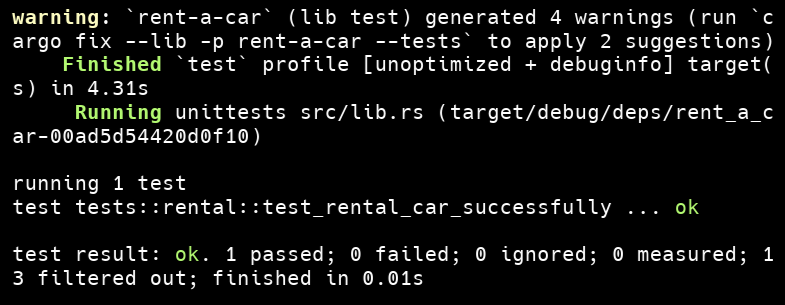
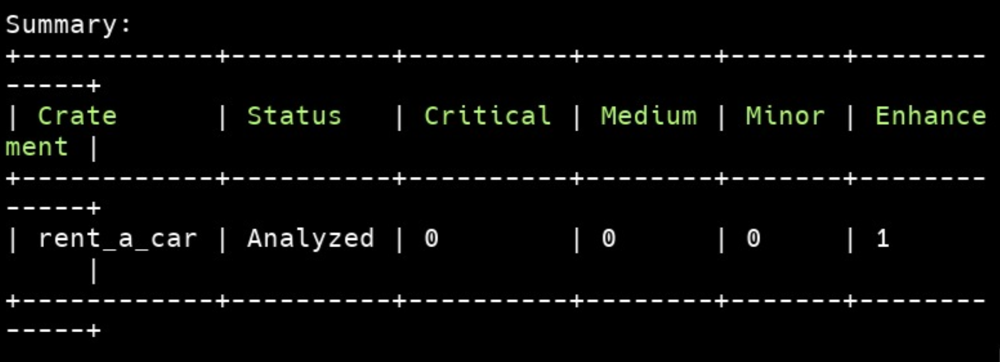
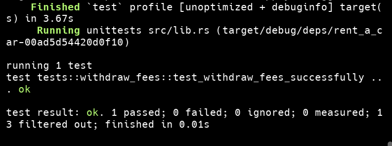
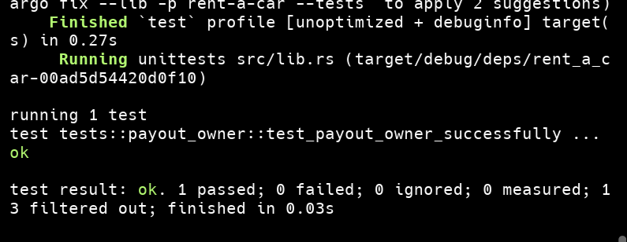

## Entrega Final del Proyecto

Como cierre del proyecto, estaremos mejorando la funcionalidad del contrato inteligente para que la dApp funcione de manera correcta y segura. ✅

## 🛠️ Cambios a implementar:

### 🧾 Comisión del administrador

El administrador podrá configurar una comisión monetaria por cada alquiler.
➜ Se agrega un nuevo almacenamiento en el contrato para guardar esta comisión.

### 💰 Depósito + Comisión

Al alquilar un auto, la comisión se sumará al valor del depósito automáticamente.

Estas asignaciones se resuelven de manera conjunta y a continuacion redacto el desarrollo de la solucion.

### Solucion

1. Se creo un nuevo archivo storage para la comision monetaria:
   contracts/rent-a-car/src/storage/rental_fee.rs

```rust
use soroban_sdk::{Address, Env};

use crate::storage::{structs::rental_fee::RentalFee, types::{errors::Error, storage::DataKey}};

pub(crate) fn has_rental_fee(env: &Env) -> bool {
    env.storage().instance().has(&DataKey::RentalFee)
}

pub(crate) fn write_rental_fee(env: &Env, rental_fee: &RentalFee) {
    env.storage().instance().set(&DataKey::RentalFee, rental_fee);
}

pub(crate) fn read_rental_fee(env: &Env) -> Result<RentalFee, Error>  {
    env.storage().instance().get(&DataKey::RentalFee).
    ok_or(Error::RentalFeeNotFound)
}
```

2. Y tambien su estructura del mismo:
   contracts/rent-a-car/src/storage/struct/rental_fee.rs

```rust
use soroban_sdk::{contracttype};

#[derive(Debug, Clone)]
#[contracttype]
pub struct RentalFee {
    pub available_to_withdraw: i128,
}
```

3. Luego procedi a modificar la funcion "rental", en el contrato:
   contracts/rent-a-car/src/contract.rs

```rust
fn rental(
        env: &Env,
        renter: Address,
        owner: Address,
        total_days_to_rent: u32,
        amount: i128,
        rental_fee: i128, // Se agrego este nuevo valor de entrada
    ) -> Result<(), Error> {
        // VALIDACIONES
        renter.require_auth();

        if amount <= 0 {
            return Err(Error::AmountMustBePositive);
        }

        if total_days_to_rent == 0 {
            return Err(Error::RentalDurationCannotBeZero);
        }

        if renter == owner {
            return Err(Error::SelfRentalNotAllowed);
        }

        let mut car = read_car(env, &owner)?;

        if car.car_status != CarStatus::Available {
            return Err(Error::CarAlreadyRented);
        }

        // LOGICA
        // total_amount = amount + rental_fee;
        let total_amount = match amount.checked_add(rental_fee) {
            Some(rental_fee) => rental_fee,
            None => return Err(Error::OverflowError),
        };

        // Se captura el fee
        let mut fee = read_rental_fee(env)?;
        fee.available_to_withdraw = fee
            .available_to_withdraw
            .checked_add(rental_fee)
            .ok_or(Error::OverflowError)?;

        token_transfer(&env, &renter, &env.current_contract_address(), &total_amount)?;

        car.car_status = CarStatus::Rented;
        car.available_to_withdraw = car
            .available_to_withdraw
            .checked_add(amount)
            .ok_or(Error::OverflowError)?;

        let rental = Rental {
            total_days_to_rent,
            amount
        };

        let mut contract_balance = read_contract_balance(&env);

        contract_balance = contract_balance
            .checked_add(total_amount)
            .ok_or(Error::OverflowError)?;

        // ALMACENAMIENTO
        write_contract_balance(&env, &contract_balance);
        write_car(env, &owner, &car);
        write_rental(env, &renter, &owner, &rental);
        write_rental_fee(env, &fee);
        // Aqui deberia existir un "write_fee"

        // EVENTOS
        events::rental::rented(env, renter, owner, total_days_to_rent, amount);

        // RESULTADO
        Ok(())
    }
```

4. Luego se modifico el test de la funcion "rental", para verificar que funcione correctamente:
   contracts/rent-a-car/src/tests/rental.rs

```rust
    let initial_rental_fee =
        env.as_contract(&contract.address, || read_rental_fee(&env)).unwrap();
    assert_eq!(initial_rental_fee.available_to_withdraw, 0);

    contract.rental(&renter, &owner, &total_days, &amount, &rental_fee);
    let contract_events = get_contract_events(&env, &contract.address);

    let updated_contract_balance =
        env.as_contract(&contract.address, || read_contract_balance(&env));
    assert_eq!(updated_contract_balance, amount + rental_fee);

    let fee = env.as_contract(&contract.address, || read_rental_fee(&env)).unwrap();
    assert_eq!(fee.available_to_withdraw, rental_fee);
```

Adjunto captura de ejecucion del test:


#### Extra

Se ejecuto "cargo scout audit" para revisar el contrato y devolvio, un error critico en la suma de los fees lo cual se corrigio y actualmente devuelve lo siguiente:


**Queda concluido de este modo esta asignacion.**

### 💸 Retiro de fondos del administrador

El administrador podrá retirar las comisiones acumuladas en cualquier momento.
➜ Se agrega una nueva función para realizar el retiro a su cuenta.

1. Primer se agrego una nueva funcion en la interfaz del contrato:
   contracts/rent-a-car/src/interfaces/contract.rs
   `fn withdraw_fees(env: &Env) -> Result<(), Error>;`

2. Luego se implemento la funcion haciendo uso del storage "rental_fee":

```rust
    fn withdraw_fees(env: &Env) -> Result<(), Error> {
        let admin = read_admin(env)?;
        admin.require_auth();

        if !has_rental_fee(env) {
            return Err(Error::RentalFeeNotFound);
        }

        let fee = read_rental_fee(env)?;

        if fee.available_to_withdraw == 0 {
            return Err(Error::NoFeeForWithdrawal);
        }

        let mut contract_balance = read_contract_balance(&env);

        if fee.available_to_withdraw > contract_balance {
            return Err(Error::BalanceNotAvailableForAmountRequested);
        }

        token_transfer(&env, &env.current_contract_address(), &admin, &fee.available_to_withdraw)?;

        contract_balance = contract_balance
            .checked_sub(fee.available_to_withdraw)
            .ok_or(Error::UnderFlowError)?;

        write_contract_balance(&env, &contract_balance);

        events::withdraw_fees::withdraw_fees(env, admin, fee.available_to_withdraw);

        Ok(())
    }
```

3. Tambien se creo el evento para la funcion
   constracts/rent-a-car/src/events/withdraw_fees.rs

```rust
use soroban_sdk::{Address, Env, Symbol};

pub(crate) fn withdraw_fees(env: &Env, admin: Address, amount: i128) {
    let topics = (Symbol::new(env, "withdraw_fees"), admin.clone());

    env.events().publish(
        topics,
        amount
    );
}
```

4. Luego se procedio a realizar el test especifico para esta funcion
   constracts/rent-a-car/src/tests/withdraw_fees.rs

```rust
use crate::{
    storage::{admin::{self, read_admin}, car::read_car, contract_balance::read_contract_balance},
    tests::config::{contract::ContractTest, utils::get_contract_events},
};
use soroban_sdk::{testutils::Address as _, Address, vec, Symbol, IntoVal};

#[test]
pub fn test_withdraw_fees_successfully() {
    let ContractTest {
        env,
        contract,
        token,
        ..
    } = ContractTest::setup();

    env.mock_all_auths();

    let owner = Address::generate(&env);
    let renter = Address::generate(&env);
    let admin = env.as_contract(&contract.address, || read_admin(&env)).unwrap();

    let price_per_day = 1500_i128;
    let total_days = 3;
    let amount = 4500_i128;
    let rental_fee=10_i128;

    let (_, token_admin, _) = token;

    let amount_mint = 10_000_i128;
    token_admin.mint(&renter, &amount_mint);

    contract.add_car(&owner, &price_per_day);
    contract.rental(&renter, &owner, &total_days, &amount, &rental_fee);

    let contract_balance = env.as_contract(&contract.address, || read_contract_balance(&env));
    assert_eq!(contract_balance, amount + rental_fee);


    contract.withdraw_fees();
    let contract_events = get_contract_events(&env, &contract.address);
    let contract_balance = env.as_contract(&contract.address, || read_contract_balance(&env));
    assert_eq!(contract_balance, amount);

    assert_eq!(
        contract_events,
        vec![
            &env,
            (
                contract.address.clone(),
                vec![
                    &env,
                    *Symbol::new(&env, "withdraw_fees").as_val(),
                    admin.clone().into_val(&env),
                ],
                rental_fee.into_val(&env)
            )
        ]
    );
}

```

Adjunto captura de la ejecucion del test:


**Queda concluido de este modo esta asignacion.**

### 🚗 Retiro de owners restringido

Los owners solo podrán retirar dinero cuando el auto esté devuelto.
➜ Se valida que si no tiene fondos disponibles, el botón Withdraw debe estar deshabilitado.

1. Se agrego un nuevo estado en "car_status", de "Returned".

```rust
use soroban_sdk::{contracttype};

#[derive(Clone, PartialEq, Debug)]
#[contracttype]
#[repr(u32)]
pub enum CarStatus {
    Available,
    Rented,
    Maintenance,
    Returned
}
```

2. Se agrego la siguiente validacion dentro de la funcion "payout_owner"

```rust
    if car.car_status != CarStatus::Returned {
        return Err(Error::CarStillRented);
    }
```

3. Se creo una nueva funcion para retornar o devolver el auto

```rust
    fn return_car(
        env: &Env,
        renter: Address,
        owner: Address
    ) -> Result<(), Error> {
        renter.require_auth();

        let mut car = read_car(env, &owner)?;

        if car.car_status != CarStatus::Rented {
            return Err(Error::CarNotRented);
        }

        car.car_status = CarStatus::Returned;

        write_car(env, &owner, &car);

        Ok(())
    }
```

4. Dentro del test de la funcion se procedio con la verificacion de su funcionalidad

```rust
    // AGREGAR: Devolver el auto para cambiar el estado a Returned
    contract.return_car(&renter, &owner);

    // Verificar que el estado del car es Returned
    let car = env.as_contract(&contract.address, || read_car(&env, &owner)).unwrap();
    assert_eq!(car.car_status, CarStatus::Returned);
```

Adjunto captura de la ejecucion del test:


**De momento aun queda pendiente la ultima asignacion.**

## Estructura del proyecto

```
odisea-rent-a-car/               # Your initialized project
├── contracts/                   # Example smart contracts
├── packages/                    # Auto-generated TypeScript clients
├── src/                         # Frontend React application
│   ├── components/              # React components
│   ├── interfaces/              # React components
│   ├── providers/               # React components
│   ├── services/                # React components
│   ├── utils/                   # React components
│   ├── contracts/               # Contract interaction helpers
│   ├── debug/                   # Debugging contract explorer
│   ├── pages/                   # App Pages
│   ├── App.tsx                  # Main application component
│   └── main.tsx                 # Application entry point
├── target/                      # Build artifacts and WASM files
├── environments.toml            # Environment configurations
├── package.json                 # Frontend dependencies
└── .env                         # Local environment variables
```

This template provides a ready-to-use frontend application with example smart contracts and their TypeScript clients. You can use these as reference while building your own contracts and UI. The frontend is set up with Vite, React, and includes basic components for interacting with the contracts.
